# Plan de trabajo — Sistema web de streaming de animes (ANIME FLV)

---

## 1. Datos de la empresa

| Dato | Detalle |
| :--- | :--- |
| **Razón social** | RenderTGM |
| **Rubro** | Desarrollo de software |
| **Ubicación** | Rompeolas, atrás de Las Peladitas |
| **Proyecto** | Sistema web de streaming de animes (ANIME FLV) |
| **Metodología** | Scrum |
| **Dominio de producción** | https://animeflv.cms.net.pe |

### 1.1 A qué se dedica la empresa

RenderTGM es una empresa dedicada al **desarrollo de software** a medida. Su trabajo abarca el análisis de requerimientos, el diseño de la arquitectura, la construcción de aplicaciones web y móviles, el despliegue en servidores propios y el soporte posterior a la puesta en producción.

Para este proyecto, RenderTGM desarrolla una plataforma web de streaming y descarga de anime que agrupa el catálogo de varios proveedores públicos en una sola interfaz, con cuentas de usuario, favoritos, historial de reproducción y un panel administrativo.

### 1.2 Equipo del proyecto

| Integrante | Rol Scrum |
| :--- | :--- |
| José Teco García | Scrum Master |
| Carlos García Cruz | Product Manager |
| Montufar Merma | Desarrollador |

---

## 2. Organigrama

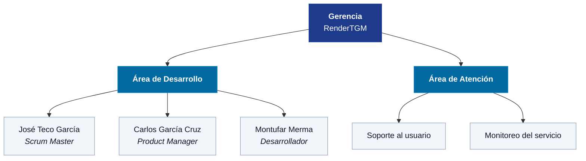

### 2.1 Responsabilidades por área

**Gerencia.** Define los objetivos del negocio, aprueba el presupuesto y prioriza la cartera de proyectos.

**Área de Desarrollo.** Construye y mantiene el sistema. Aquí opera el equipo Scrum: el Product Manager gestiona el Product Backlog y representa al cliente; el Scrum Master facilita las ceremonias y remueve los impedimentos; el Desarrollador implementa las historias de usuario comprometidas en cada Sprint.

**Área de Atención.** Atiende las incidencias reportadas por los usuarios finales, vigila la disponibilidad del servicio en producción y escala al Área de Desarrollo los defectos que requieren cambios en el código.

---

## 3. Metodología Scrum

El proyecto se ejecuta con **Scrum**, en Sprints de **dos semanas**.

### 3.1 Ceremonias

| Ceremonia | Frecuencia | Duración | Participantes |
| :--- | :--- | :--- | :--- |
| Sprint Planning | Inicio de cada Sprint | 2 h | Equipo completo |
| Daily Scrum | Diaria | 15 min | Equipo de desarrollo |
| Sprint Review | Fin de cada Sprint | 1 h | Equipo + Gerencia |
| Sprint Retrospective | Fin de cada Sprint | 1 h | Equipo completo |
| Refinamiento del Backlog | Semanal | 1 h | Product Manager + Desarrollador |

### 3.2 Artefactos

- **Product Backlog**: lista priorizada de requerimientos, a cargo del Product Manager.
- **Sprint Backlog**: subconjunto comprometido para el Sprint en curso.
- **Incremento**: versión desplegada y funcional al cierre de cada Sprint.

### 3.3 Definición de Terminado

Una historia se considera terminada cuando el código está implementado y probado, las validaciones de entrada están cubiertas, la funcionalidad fue verificada contra el ambiente de producción y el Product Manager la aceptó en la Sprint Review.

### 3.4 Planificación de Sprints

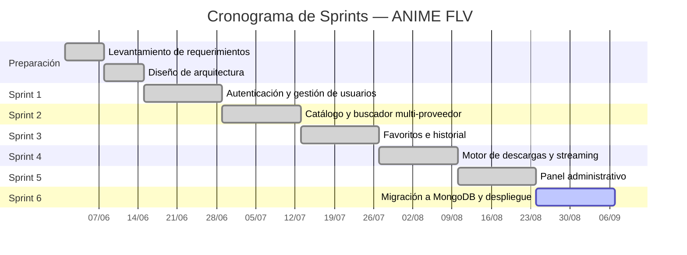

---

## 4. Requerimientos funcionales

| Código | Requerimiento | Descripción | Prioridad |
| :--- | :--- | :--- | :--- |
| **RF-01** | Inicio de sesión | El sistema debe permitir al usuario autenticarse con correo y contraseña, devolviendo un token de acceso. | Alta |
| **RF-02** | Renovación de sesión | El sistema debe renovar el token de acceso mediante un token de refresco almacenado en una cookie HTTP-Only. | Alta |
| **RF-03** | Cierre de sesión | El sistema debe permitir cerrar la sesión invalidando la cookie de refresco. | Media |
| **RF-04** | Consulta de perfil | El sistema debe permitir al usuario consultar los datos de su cuenta. | Media |
| **RF-05** | Cambio de avatar | El sistema debe permitir al usuario seleccionar su imagen de perfil de un catálogo predefinido. | Baja |
| **RF-06** | Cambio de contraseña | El sistema debe permitir al usuario cambiar su contraseña validando la contraseña actual. | Alta |
| **RF-07** | Búsqueda de anime | El sistema debe permitir buscar animes por título y filtrar por género, consultando múltiples proveedores. | Alta |
| **RF-08** | Recomendaciones | El sistema debe mostrar un listado de animes recomendados en la página de inicio. | Media |
| **RF-09** | Consulta de géneros | El sistema debe listar los géneros disponibles para el filtrado. | Baja |
| **RF-10** | Detalle de anime | El sistema debe mostrar la sinopsis, portada, estado y lista de episodios de un anime. | Alta |
| **RF-11** | Obtención de enlaces | El sistema debe resolver los enlaces de reproducción de un episodio desde los servidores del proveedor. | Alta |
| **RF-12** | Descarga de episodio | El sistema debe permitir descargar un episodio en la variante elegida (SUB o DUB). | Alta |
| **RF-13** | Descarga por lote | El sistema debe permitir encolar la descarga de varios episodios en una sola operación. | Media |
| **RF-14** | Progreso en tiempo real | El sistema debe notificar el avance, la finalización y los errores de descarga mediante WebSocket. | Alta |
| **RF-15** | Descarga por streaming | El sistema debe permitir la descarga directa del episodio como flujo continuo. | Media |
| **RF-16** | Proxy de imágenes | El sistema debe servir las portadas a través del backend para evitar el bloqueo por hotlinking. | Media |
| **RF-17** | Agregar favorito | El sistema debe permitir marcar un anime como favorito, sin duplicados por usuario. | Alta |
| **RF-18** | Listar favoritos | El sistema debe listar los favoritos del usuario ordenados por fecha de agregado. | Alta |
| **RF-19** | Eliminar favorito | El sistema debe permitir quitar un anime de la lista de favoritos. | Media |
| **RF-20** | Registrar progreso | El sistema debe guardar el último episodio visto por anime, actualizándolo si ya existe. | Alta |
| **RF-21** | Continuar viendo | El sistema debe listar el historial de reproducción ordenado por fecha de actualización. | Alta |
| **RF-22** | Eliminar progreso | El sistema debe permitir borrar una entrada del historial. | Baja |
| **RF-23** | Estadísticas | El sistema debe mostrar al administrador el total de usuarios, altas recientes, activos, suspendidos, favoritos y entradas de historial. | Media |
| **RF-24** | Listado de usuarios | El sistema debe listar los usuarios con paginación, búsqueda por nombre o correo y filtro por estado. | Alta |
| **RF-25** | Crear usuario | El sistema debe permitir al administrador registrar usuarios, con rol y vigencia opcional en días. | Alta |
| **RF-26** | Editar usuario | El sistema debe permitir modificar nombre, correo, contraseña, rol y fecha de vencimiento. | Alta |
| **RF-27** | Suspender usuario | El sistema debe permitir suspender y reactivar cuentas, impidiendo el acceso mientras estén suspendidas. | Alta |
| **RF-28** | Eliminar usuario | El sistema debe permitir eliminar una cuenta junto con sus favoritos e historial. | Media |
| **RF-29** | Control de vigencia | El sistema debe denegar el acceso a las cuentas cuya fecha de vencimiento haya pasado, salvo a los administradores. | Alta |
| **RF-30** | Protección por rol | El sistema debe restringir las funciones administrativas a los usuarios con rol de administrador. | Alta |
| **RF-31** | Reproducción sin anuncios | El sistema debe reproducir el episodio en un reproductor propio, sirviendo el video directamente desde el backend sin cargar la página del proveedor ni su publicidad. | Alta |
| **RF-32** | Selección de servidor compatible | El sistema debe priorizar automáticamente los servidores que permiten la reproducción incrustada y descartar los que la bloquean. | Alta |
| **RF-33** | Alternancia de reproductor | El sistema debe permitir cambiar entre el reproductor propio y el del proveedor, y ofrecer esa alternativa cuando la reproducción directa falle. | Media |
| **RF-34** | Avance y retroceso | El sistema debe permitir desplazarse dentro del episodio durante la reproducción directa. | Media |

---

## 5. Requerimientos no funcionales

| Código | Categoría | Requerimiento |
| :--- | :--- | :--- |
| **RNF-01** | Seguridad | Las contraseñas deben almacenarse cifradas con Bcrypt y un factor de costo de 12. |
| **RNF-02** | Seguridad | La autenticación debe basarse en JWT; el token de refresco debe viajar en una cookie HTTP-Only. |
| **RNF-03** | Seguridad | El estado de suspensión y la vigencia deben verificarse en cada petición autenticada, no solo al iniciar sesión. |
| **RNF-04** | Seguridad | El servidor debe aplicar cabeceras de protección mediante Helmet y una política de CORS con credenciales. |
| **RNF-05** | Seguridad | Los endpoints del catálogo deben exigir una clave de API. |
| **RNF-06** | Seguridad | La base de datos debe requerir autenticación y escuchar solo en la interfaz local. |
| **RNF-07** | Seguridad | Las credenciales y secretos deben residir en variables de entorno, nunca en el repositorio. |
| **RNF-08** | Rendimiento | Las respuestas del catálogo deben servirse desde una caché en memoria para reducir las consultas a los proveedores. |
| **RNF-09** | Rendimiento | Las respuestas HTTP deben enviarse comprimidas. |
| **RNF-10** | Rendimiento | Las colecciones deben contar con índices sobre los campos de búsqueda y las claves únicas. |
| **RNF-11** | Rendimiento | Los recursos estáticos del frontend deben servirse con caché de larga duración. |
| **RNF-12** | Usabilidad | La interfaz debe ser responsiva y adaptarse a pantallas de escritorio y móviles. |
| **RNF-13** | Usabilidad | Los mensajes de error mostrados al usuario deben estar redactados en español. |
| **RNF-14** | Usabilidad | El avance de las descargas debe reflejarse en pantalla sin recargar la página. |
| **RNF-15** | Disponibilidad | El backend debe reiniciarse automáticamente ante una caída y al reiniciar el servidor. |
| **RNF-16** | Disponibilidad | Las descargas prolongadas deben tolerar tiempos de espera de hasta una hora. |
| **RNF-17** | Mantenibilidad | Cada proveedor de contenido debe implementarse en un servicio independiente e intercambiable. |
| **RNF-18** | Mantenibilidad | El esquema de datos debe versionarse mediante scripts de migración ejecutables. |
| **RNF-19** | Mantenibilidad | El contrato del API debe permanecer estable ante cambios en el motor de base de datos. |
| **RNF-20** | Portabilidad | El sistema debe operar sobre Node.js 18 o superior en servidores Linux. |
| **RNF-21** | Escalabilidad | El servicio debe admitir el registro de nuevos proveedores sin modificar la capa de rutas. |
| **RNF-22** | Compatibilidad | El sitio debe funcionar en las versiones actuales de los navegadores de escritorio y móviles. |
| **RNF-23** | Compatibilidad | La reproducción debe funcionar sin depender de bloqueadores de publicidad instalados en el navegador del usuario. |
| **RNF-24** | Seguridad | El flujo de video debe autenticarse mediante la cookie de sesión HTTP-Only, sin exponer claves ni tokens en la URL. |
| **RNF-25** | Rendimiento | La resolución del enlace de video no debe superar los diez segundos antes de iniciar la reproducción. |
| **RNF-26** | Escalabilidad | El servidor debe liberar el proceso de retransmisión en cuanto el usuario abandone la reproducción, para no acumular flujos abiertos. |

---

## 6. Diagrama de casos de uso

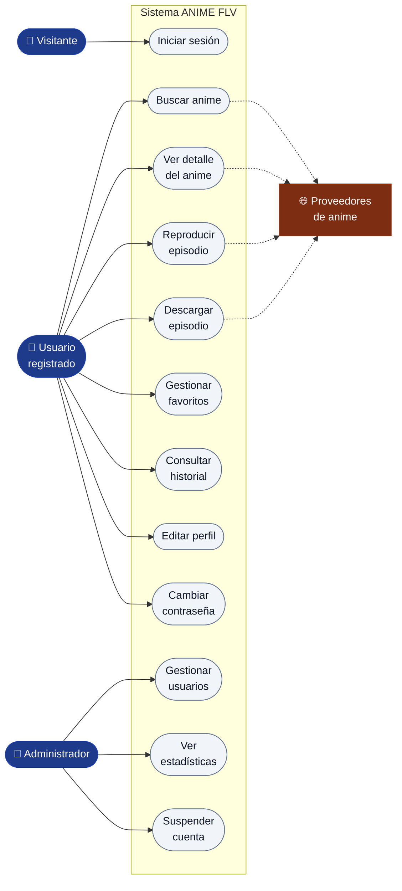

### 6.1 Especificación del caso de uso «Descargar episodio»

| Campo | Detalle |
| :--- | :--- |
| **Actor principal** | Usuario registrado |
| **Precondición** | El usuario tiene sesión activa y vigente |
| **Postcondición** | El archivo del episodio queda disponible para su descarga |
| **Flujo principal** | 1. El usuario busca el anime. 2. Selecciona el episodio y la variante (SUB o DUB). 3. El sistema resuelve los enlaces del proveedor. 4. El sistema descarga y procesa el video. 5. El sistema informa el avance por WebSocket. 6. El sistema entrega el enlace de descarga final. |
| **Flujo alternativo** | 3a. Si ningún servidor responde, el sistema informa el error y sugiere otra variante. |
| **Excepción** | Si la sesión expiró durante el proceso, el sistema responde 401 y solicita autenticarse de nuevo. |

---

## 7. Diagrama de clases

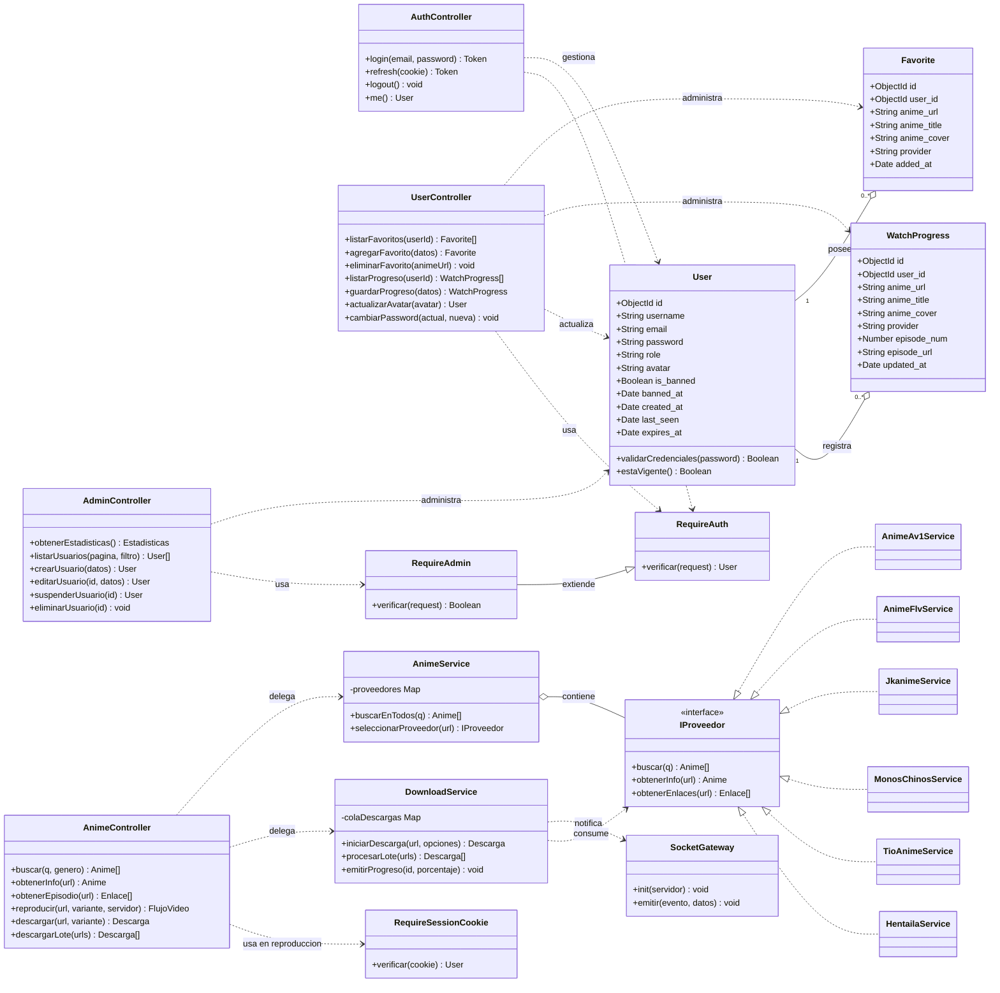

---

## 8. Diagrama entidad–relación

El sistema utiliza **MongoDB**, por lo que las entidades corresponden a colecciones de documentos. La relación entre ellas se mantiene por referencia mediante el campo `user_id`.

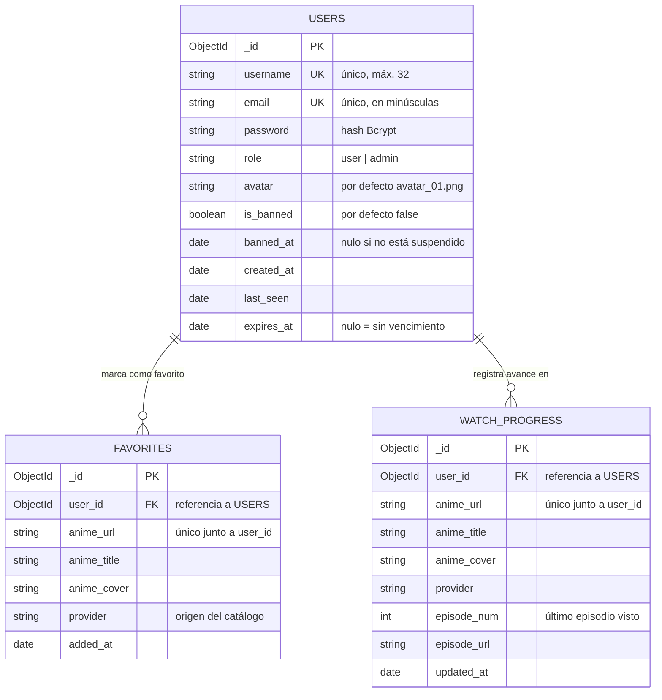

### 8.1 Restricciones de integridad

- `users.email` y `users.username` cuentan con índice único.
- `favorites` y `watch_progress` tienen índice único compuesto sobre `(user_id, anime_url)`, lo que impide duplicar un anime por usuario.
- Al eliminar un usuario, la aplicación borra sus favoritos y su historial, ya que MongoDB no ofrece borrado en cascada nativo.
- Los datos del catálogo (títulos, portadas, episodios) no se almacenan: provienen en tiempo real de los proveedores externos.

---

## 9. Diagramas de secuencia

### 9.1 Inicio de sesión

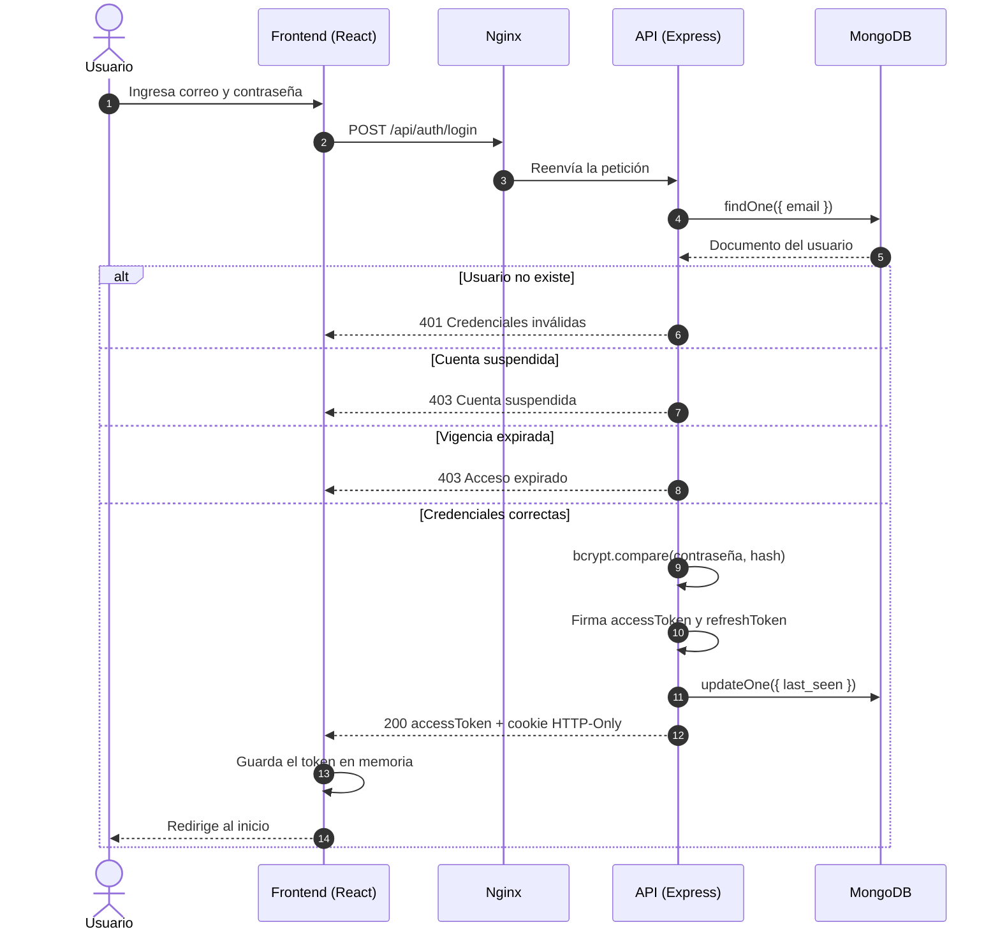

### 9.2 Búsqueda de anime multi-proveedor

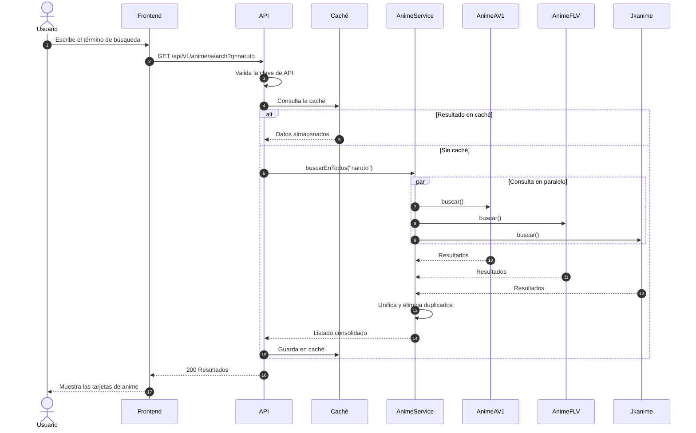

### 9.3 Descarga de episodio con progreso en tiempo real

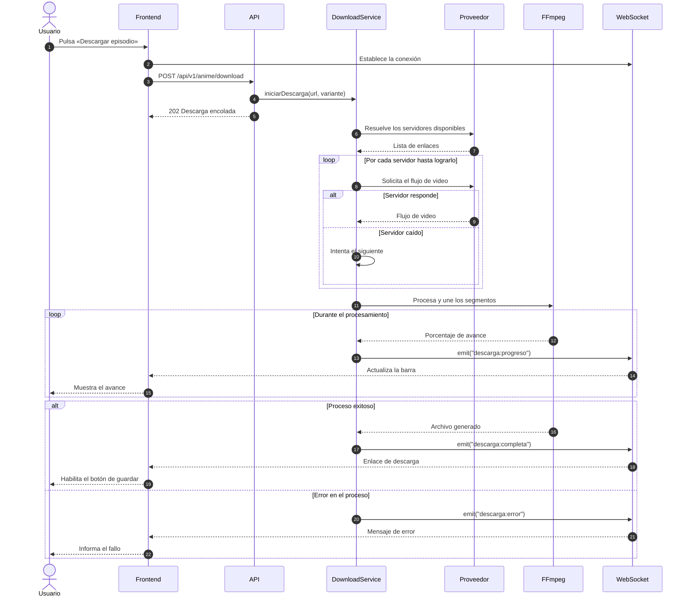

### 9.4 Reproducción sin anuncios

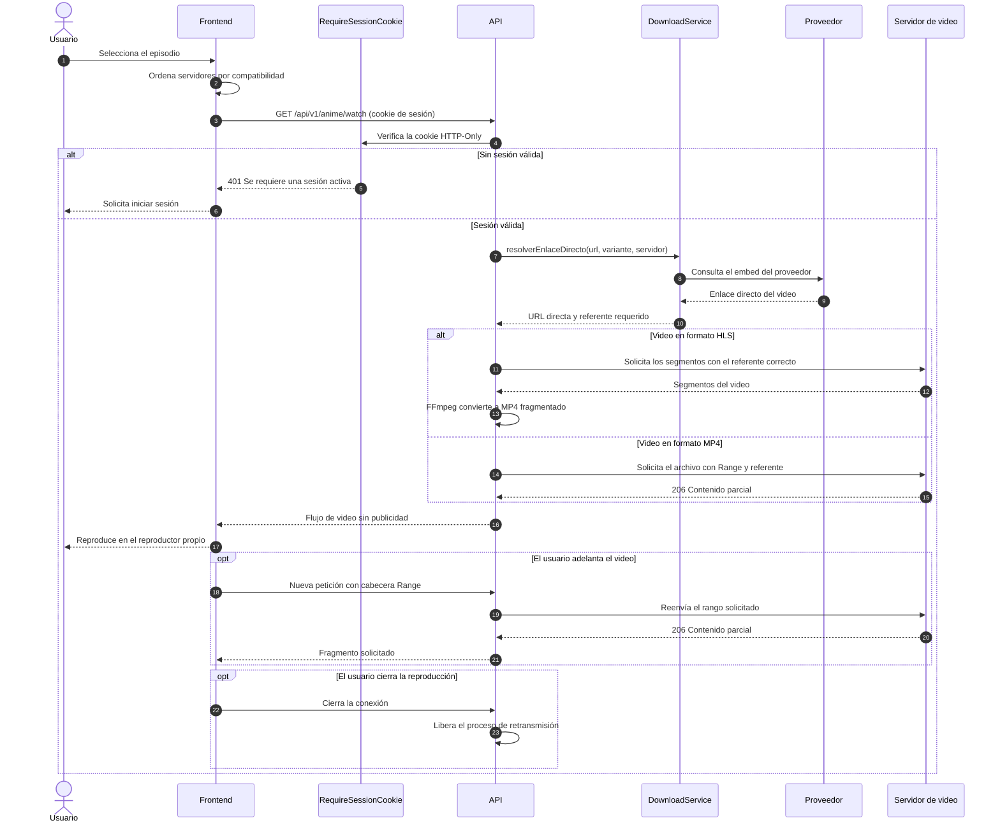

### 9.5 Suspensión de una cuenta por el administrador

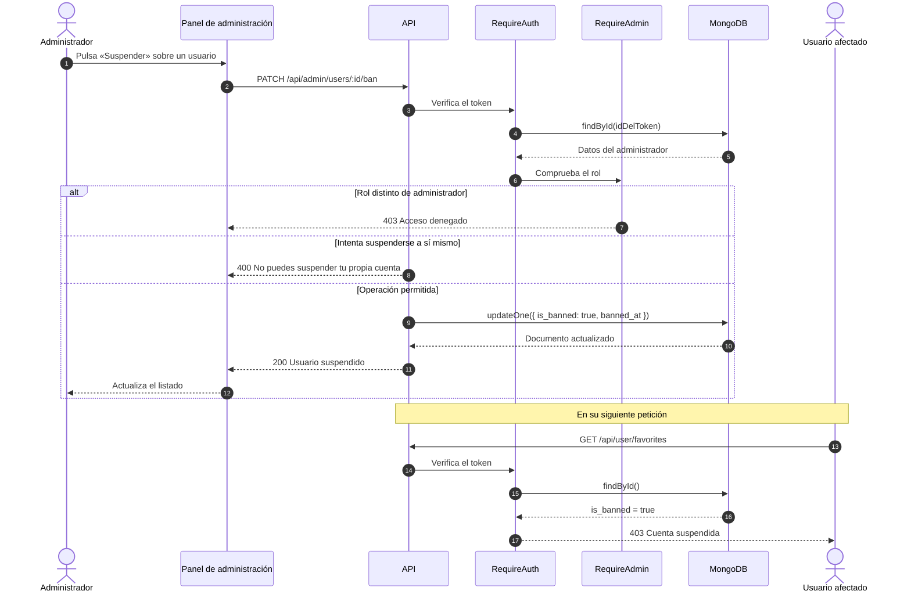

---

## 10. Arquitectura de la solución

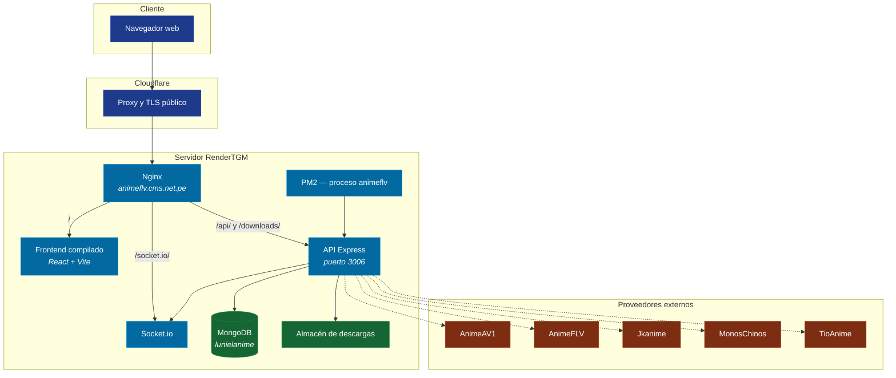

### 10.1 Pila tecnológica

| Capa | Tecnologías |
| :--- | :--- |
| Frontend | React 19, Vite, Tailwind CSS, React Router, Socket.io-client |
| Backend | Node.js, Express, Socket.io, Axios, Cheerio, Puppeteer |
| Procesamiento de video | FFmpeg, Fluent-FFmpeg |
| Persistencia | MongoDB 8, Mongoose |
| Seguridad | JWT, Bcrypt, Helmet, cookies HTTP-Only |
| Infraestructura | Nginx, PM2, Cloudflare, Ubuntu Server |

---

## 11. Entregables

| Entregable | Descripción | Estado |
| :--- | :--- | :--- |
| Documento de requerimientos | Requerimientos funcionales y no funcionales | Entregado |
| Diagramas del sistema | Clases, secuencia, casos de uso y entidad–relación | Entregado |
| Aplicación web | Frontend y backend operativos | Entregado |
| Scripts de migración | Creación de colecciones e índices, y traspaso de datos | Entregado |
| Despliegue en producción | Sistema publicado en el dominio institucional | Entregado |
| Manual de usuario | Guía de uso para el usuario final | Pendiente |
| Manual técnico | Guía de instalación y mantenimiento | Pendiente |

---

## 12. Riesgos identificados

| Riesgo | Impacto | Probabilidad | Mitigación |
| :--- | :--- | :--- | :--- |
| Cambio en la estructura de los sitios proveedores | Alto | Alta | Aislar cada proveedor en su propio servicio para acotar la corrección |
| Bloqueo del servidor por parte de un proveedor | Alto | Media | Rotación de proveedores y proxy de imágenes |
| Caída del servicio de descargas por consumo de recursos | Medio | Media | Reinicio automático mediante PM2 y límite de caché de la base de datos |
| Clave de API expuesta en el paquete del frontend | Medio | Alta | Rotar la clave y restringir por origen de la petición |
| Pérdida de datos de usuarios | Alto | Baja | Copias de seguridad periódicas de la base de datos |
| Saturación del ancho de banda por la reproducción directa | Alto | Media | El video se retransmite por el servidor: vigilar el consumo y limitar las reproducciones simultáneas |
| Bloqueo del reproductor propio por el proveedor del video | Medio | Media | Conservar el reproductor del proveedor como alternativa seleccionable |

---

## 13. Conclusiones

El sistema ANIME FLV cubre los treinta y cuatro requerimientos funcionales previstos y se encuentra desplegado y operativo en el dominio institucional. La arquitectura por servicios independientes para cada proveedor permite absorber los cambios frecuentes de los sitios de origen sin afectar al resto del sistema, que es el riesgo principal identificado para este proyecto.

La migración del motor de base de datos a MongoDB se ejecutó conservando el contrato del API, de modo que el frontend no requirió modificaciones. Quedan pendientes de elaboración el manual de usuario y el manual técnico.

---

**RenderTGM** — Desarrollo de software
Rompeolas, atrás de Las Peladitas

